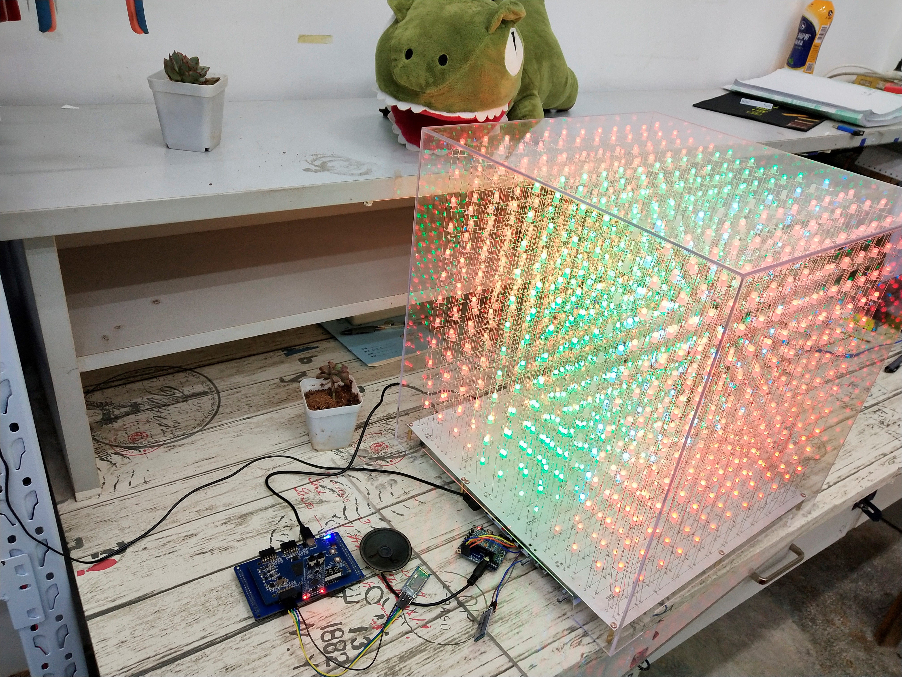
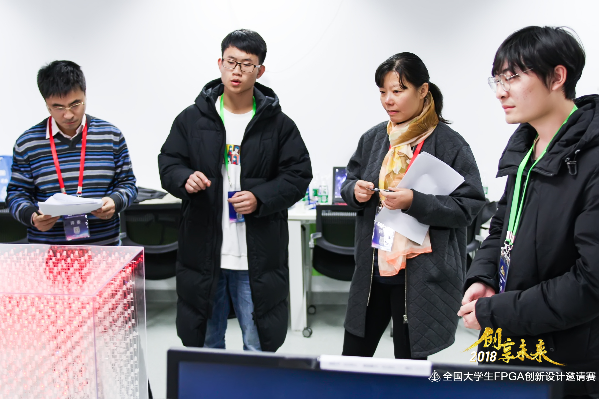

# LightCube<br>A 3D Dynamic Display System Based on Voice Control

<p align="right">
  <a href="https://github.com/Charmve/Design-of-a-3D-Dynamic-Display-System-Based-on-Voice-Control/blob/master/02_Design%20Report/%E3%80%8A%E5%9F%BA%E4%BA%8EFPGA%E7%9A%84%E6%99%BA%E8%83%BD%E8%AF%AD%E9%9F%B33D%E5%8A%A8%E6%80%81%E6%98%BE%E7%A4%BA%E7%B3%BB%E7%BB%9F%C2%B7%E8%AE%BE%E8%AE%A1%E6%8A%A5%E5%91%8A%E3%80%8B.pdf" target="_blank"></a>
  <a href="https://github.com/Charmve/Design-of-a-3D-Dynamic-Display-System-Based-on-Voice-Control/tree/master/01_LightCube-Projects/01_LightCube" target="_blank"></a>
  <a href="https://github.com/Charmve/Design-of-a-3D-Dynamic-Display-System-Based-on-Voice-Control/tree/master/06_Licences" target="_blank"></a>
</p>

 

<p align="center"><a href="https://www.youtube.com/watch?v=-jAfvdNz-kE" target="_blank"></a>  <a href="https://www.bilibili.com/video/BV1cJ411C7NR" target="_blank"></a></p>

<br>

<h3 align="center"> 一种基于语音控制的3D动态显示系统设计</h3>

<p align="center"><a href="https://charmve.github.io/" target="_blank">张 伟</a><br>
（扬州大学 物理科学与技术学院，江苏扬州 225000 ）</p>

<p><b>摘要</b></p>
<p>&nbsp &nbsp &nbsp &nbsp光立方作为一种新型的裸眼3D显示技术，用户不需要配戴任何观看辅助工具就能达到裸眼3D显示的效果，给人们带来了全新的视觉体验。本文设计一种基于语音控制的3D动态显示系统，采用LD3320非特定人声语音识别芯片以及STM32F407作为光立方核心控制器实现全彩高阶的语音控制光立方设计，解决了现有光立方显示色彩单一、分辨率低、人机交互性能差、设计复杂、成本较高等的问题。语音识别模块与STM32之间采用UART串口通信，将语音识别结果作为控制指令发送给STM32，控制光立方的显示动画和工作模式，并用模块自带的喇叭播放背景音乐。SM16126串转并级联驱动输出电路的设计，降低了系统功耗，为高阶光立方的设计提供了一种可行的实现方案。测试表明，光立方显示系统对语音指令识别的响应速度快、识别精度高、工作稳定，具有较好的使用体验，使人们的生活更加智能化和人性化。</p>

<p><b>关键词：</b>光立方；语音控制；STM32；全彩显示；裸眼 3D</p>

<br>
<h3 align="center">Design of a 3D Dynamic Display System Based on Voice Control</h3>

<p align="center"><a href="https://charmve.github.io/" target="_blank">Wei Zhang *</a> <br>
*School of Physical Science and Technology, Yangzhou University, Yangzhou 225000, China </p>

<p><strong>Abstract：</strong></p> 
<p>Light Cube, as a new type of naked eye 3D display technology, can achieve the naked eye 3D display without wearing any viewing aids. Especially, it brings a new visual experience to people and has become a research hot spot in research organizations home and abroad for the past few years. In this paper, a 3D dynamic display system based on voice control is presented, which solves the existing light cube display color single, low resolution, poor human-computer interaction performance, complex design, high cost, etc. The LD3320 non-specific vocal speech recognition chip and STM32F407 are used as controller core to realize the full-color high-order voice controlled light cube. The voice recognition module sends the voice recognition result to the STM32 via UART serial port as a control command for controlling the display animation and working mode of the optical cube, and playing the background music with the speaker provided by the module. The SM16126 cascade-to-cascade drive output circuit design reduces system power consumption and provides a viable implementation for high-order optical cube designs. Finally, tests show that this light cube display system has fast voice command recognition response speed, high recognition accuracy and stable work performance, which can make people's life more intelligent and user-friendly.</p>

<p><strong>Key words：</strong>Light cube; voice control; STM32; full-color display; naked eye 3D</p>

<br>

<p align="center"><a href="https://www.youtube.com/watch?v=-jAfvdNz-kE" target="_blank"></a>
<br>(click this picture to watch a video)</p>

<br>

 

<br>

## Acknowledgements

<p>在此，我要非常感谢我的伙伴：沈福周，是他一直陪伴我把这个项目做下去，他在这个项目中也贡献了十分大的力量。在大学阶段遇到这样一位伙伴，我十分荣幸。同时，我也要感谢我的指导老师：陈磊老师，是他给我们提供指导和来自学校的资金支持。没有你们的帮助，是不能顺利完成这个项目的。PS：整个项目耗时半年，焊接整个光立方花了20多天 -_- （在此，也得感谢我的室友们，以及孙吉乔跟我们一起焊接！）</p>

<p><b>English Version:</b> Here, I would like to thank my partner: Shen Fuzhou, who has been with me to continue this project, and he has also contributed a lot to this project. I am honored to meet such a partner in college. At the same time, I would also like to thank my instructor: Mr. Chen Lei, who provided us with guidance and financial support from the school. Without your help, this project cannot be successfully completed. PS: The whole project took half a year, and it took more than 20 days to weld the entire light cube -_- (Here, I have to thank my roommates and Sun Jiqiao for welding with us!)</p>

## Notification

<p>本项目因为是基金项目，一方面为了公益性而开源，另一方面为了著作权所有而申请了<a href="https://github.com/Charmve/Design-of-a-3D-Dynamic-Display-System-Based-on-Voice-Control/tree/master/06_Licences" target="_blank">国家专利保护📑</a>。 如有商业用途，请与我联系。</p>

<p><b>English Version:</b> Because this project is a funded project, on the one hand, it is open source for public welfare, and on the other hand, it has applied for <a href="https://github.com/Charmve/Design-of-a-3D-Dynamic-Display-System-Based-on-Voice-Control/tree/master/06_Licences" target="_blank">national patents protection 📑</a> for copyright ownership. If you have any commercial use, please contact me.</p>

If you have any questions or idea, please let me know :email: yidazhang1@gmail.com


## Citation
Use this bibtex to cite this repository:
```
@misc{LightCube,
  title={A Design of 3D Dynamic Display System Based on Voice Control},
  author={Charmve},
  year={2019.11},
  publisher={Github},
  journal={GitHub repository},
  howpublished={\url{https://github.com/Charmve/LightCube-A-Design-of-3D-Dynamic-Display-System-Based-on-Voice-Control}},
}
```
<a href="https://charmve.github.io/doc/papers/一种基于语音控制的3D动态显示系统设计.pdf" target="_blank">[Paper (Chinese)]</a> | <a href="https://charmve.github.io/doc/src/作品海报Poster.pdf" target="_blank">[Poster]</a> | <a href="https://charmve.github.io/doc/src/基于FPGA的智能语音3D动态显示系统·Slides.pdf" target="_blank">[Slides]</a> | <a href="https://charmve.github.io/doc/src/基于FPGA的智能语音3D动态显示系统·Slides.pdf" target="_blank">[Patents]</a> | <a href="https://charmve.github.io/doc/src/基于FPGA的智能语音3D动态显示系统·Slides.pdf" target="_blank">[Slides]</a>


<br>
* <i>Update by Sep 27，2020 @<a href="https://github.com/Charmve" target="_blank">Charmve</a>, 
    <a class="github-button"
        href="https://github.com/Charmve/Surface-Defect-Detection"
        data-icon="octicon-star" data-show-count="true"
        aria-label="Star Charmve/Surface-Defect-Detection on GitHub">Star</a> 
    and 
    <a class="github-button"
        href="https://github.com/Charmve/Surface-Defect-Detection/fork"
        data-icon="octicon-repo-forked" data-show-count="true"
        aria-label="Fork Charmve/Surface-Defect-Detection on GitHub">Fork</a>
</i>

